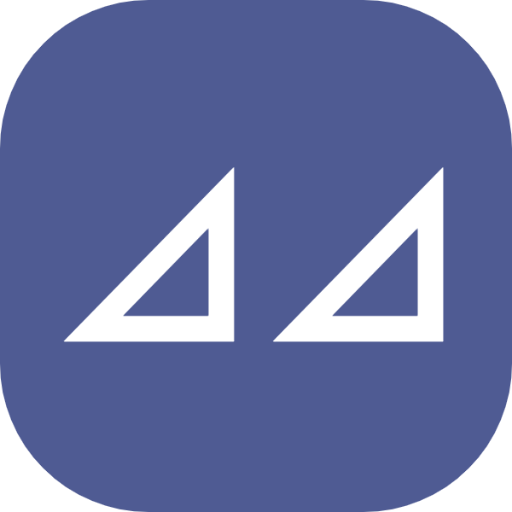

<div align=center>


<br/>
<br/>


[](https://github.com/naroat/ivory/blob/main/LICENSE)

<br/>


</div>

## Ivory是什么？

Ivory(象牙)是一个实用，高效和可重用的PHP语言工具包。帮助开发者更加高效地开发PHP应用。Ivory包含的工具包括:
- 字符串和数组处理
- 日期&时间
- 加密&解密
- 其他工具包：文件、网络、随机、验证器等

## 安装

版本要求：
- PHP >= 7.2
- composer >= 2.0

安装:
```shell
composer require naroat/ivory
```

## 使用

示例：求两个日期之间相差的天数：
```php
$startDate = '2024-10-03';
$endDate = '2024-12-10';
$res = \Naroat\Ivory\DateTime\DateTime::dateDiff($startDate, $endDate);
var_dump($res);
//output:
//int(68)
```

示例：私隐化邮箱示例

```php
$res = \Naroat\Ivory\Str\Str::hideEmail('foo123456@bar.com');
var_dump($res);
//output: "foo***@bar.com"

$res = \Naroat\Ivory\Str\Str::hideEmail('foo123456@bar.com', '---@');
var_dump($res);
//output: "foo---@bar.com"
```

## 更多

更多特性请参考[API](zh-cn/api/string.md).

